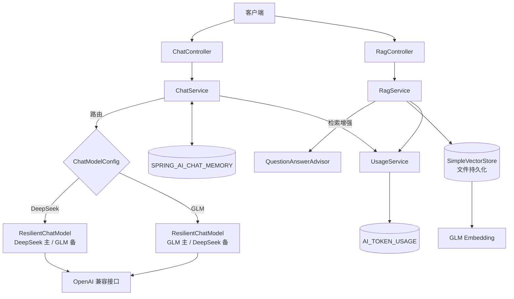

# Spring AI 多模型对话服务

基于 **Spring Boot 4.0.8** 和 **Spring AI 2.0.0** 构建的多模型 AI 对话服务。提供统一的 RESTful API，支持 **DeepSeek** 与 **GLM（智谱）** 两种大语言模型，并集成同步/流式对话、会话记忆持久化、RAG 向量检索、模型降级重试、Token 用量与成本统计等能力。

## 🚀 核心特性

- **多模型接入**：统一封装 DeepSeek 与 GLM 模型，通过 `provider` 参数动态路由。
- **流式输出（SSE）**：支持 Server-Sent Events 流式响应，逐 token 返回。
- **会话记忆持久化**：基于 `JdbcChatMemoryRepository` 将对话记忆落库 MySQL，外层保留 10 条滑动窗口。
- **RAG 向量检索**：GLM 嵌入模型 + `SimpleVectorStore` 文件持久化，支持文档摄入与知识库问答。
- **模型降级 + 重试**：`ResilientChatModel` 在模型层对 transient 错误（网络/超时/429/5xx）自动重试，仍失败则降级到备用模型，且不污染会话记忆。
- **Token 用量 & 成本记录**：对话与嵌入（embedding）的 token 用量自动落库，并按模型单价核算成本。
- **联网搜索工具**：`WebSearchTool` 调用 DuckDuckGo 免费接口，支持 Function Calling 联网检索。
- **全局异常处理 & 参数校验**：统一错误响应格式，`@NotBlank` 校验入参。

## 🛠 技术栈

| 组件 | 版本 | 说明 |
| :--- | :--- | :--- |
| Java | 17 | LTS 版本 |
| Spring Boot | 4.0.8 | 核心框架 |
| Spring AI | 2.0.0 | AI 集成框架 |
| Gradle | 9.7.1 | 构建工具 |
| MySQL | 8.x | 会话记忆 + 用量记录存储 |

## 📁 项目结构

```
src/main/java/com/example/spring_ai/
├── SpringAiApplication.java           # 应用启动类
├── config/
│   ├── ChatMemoryConfig.java          # 会话记忆（JDBC 持久化 + 10 条窗口）
│   ├── ChatModelConfig.java           # 多模型初始化 + ResilientChatModel 包装
│   ├── ResilientChatModel.java        # 重试 + 降级装饰器
│   ├── RagConfig.java                 # 嵌入模型 + 向量库 + 文本切分器
│   ├── UsageTrackingEmbeddingModel.java # 嵌入用量统计装饰器
│   ├── LoggingAdvisors.java           # 日志 + 用量记录 Advisor
│   ├── PricingProperties.java         # 成本单价配置
│   ├── GlobalExceptionHandler.java    # 全局异常处理
│   └── WebSearchTool.java             # 联网搜索工具
├── controller/
│   ├── ChatController.java            # 对话接口
│   └── RagController.java             # RAG 接口
├── dto/
│   ├── ChatRequest.java               # 对话请求体
│   ├── ChatResponse.java              # 对话响应体
│   ├── RagIngestRequest.java          # RAG 摄入请求体
│   └── ErrorResponse.java             # 统一错误响应体
├── model/
│   └── ModelProvider.java             # 模型提供方枚举
└── service/
    ├── ChatService.java               # 对话编排与模型路由
    ├── RagService.java                # 文档摄入与检索增强问答
    └── UsageService.java              # Token 用量落库

src/main/resources/
└── application.properties             # 应用配置

db/
├── chat-memory-mysql.sql              # 会话记忆表建表脚本
└── token-usage-mysql.sql              # 用量表建表脚本（手动执行用）
```

## ⚙️ 环境变量

| 变量 | 必填 | 说明 |
| :--- | :--- | :--- |
| `DEEPSEEK_API_KEY` | 是 | DeepSeek API Key |
| `GLM_API_KEY` | 是 | 智谱 GLM API Key（需开通 embedding 权限，用于 RAG） |
| `MYSQL_USER` | 否 | MySQL 用户名，默认 `root` |
| `MYSQL_PASSWORD` | 视情况 | MySQL 密码；若 MySQL 未设置密码可留空 |

> 通过**系统环境变量**（或 JVM 启动参数）配置，`application.properties` 用 `${VAR:}` 占位符读取。
> 注意：Spring Boot 默认**不会自动加载**项目根目录的 `.env` 文件；若要使用 `.env`，请额外引入 dotenv 依赖、使用 IDE 的 EnvFile 插件，或手动 `export` 后再启动。

## 🗄 数据库初始化

先建库：

```bash
mysql -u root -p -e "CREATE DATABASE IF NOT EXISTS spring_ai DEFAULT CHARSET utf8mb4;"
```

然后建两张表：

1. **`SPRING_AI_CHAT_MEMORY`** — 会话记忆（Spring AI 内置结构，默认 `initialize-schema=never`，需手动建表）：
   ```bash
   mysql -u root -p spring_ai < db/chat-memory-mysql.sql
   ```
   或将 `spring.ai.chat.memory.repository.jdbc.initialize-schema` 改为 `always` 自动建表。

2. **`AI_TOKEN_USAGE`** — Token 用量与成本：
   ```bash
   mysql -u root -p spring_ai < db/token-usage-mysql.sql
   ```

## 🔌 API 接口

统一错误响应格式：

```json
{ "code": 400, "message": "message: message 不能为空" }
```

`code` 为 HTTP 状态码（400 为参数/业务错误，500 为服务器内部错误）。

### 1. 同步对话

**`POST /api/chat`**

```bash
curl -X POST http://localhost:8080/api/chat \
  -H "Content-Type: application/json" \
  -d '{
    "provider": "deepseek",
    "conversationId": "user-123",
    "message": "用一句话介绍 Spring AI",
    "system": "你是一名 Java 架构师"
  }'
```

| 字段 | 必填 | 说明 |
| :--- | :--- | :--- |
| `message` | 是 | 用户输入 |
| `provider` | 否 | `deepseek`（默认）/ `glm` |
| `conversationId` | 否 | 会话 ID，用于区分会话记忆 |
| `system` | 否 | 自定义系统提示词 |

响应：`{ "content": "..." }`

### 2. 流式对话（SSE）

**`GET /api/chat/stream`**

```bash
curl "http://localhost:8080/api/chat/stream?provider=glm&conversationId=user-123&message=讲个笑话"
```

返回 `text/event-stream` 格式，客户端按 SSE 协议逐段解析。

### 3. 摄入知识库文档（RAG）

**`POST /api/rag/ingest`**

```bash
curl -X POST http://localhost:8080/api/rag/ingest \
  -H "Content-Type: application/json" \
  -d '{"text": "Spring AI 是用于在 Java 中集成 AI 的框架...", "metadata": {"source": "README.md"}}'
```

响应：`{ "chunks": 3 }`（切分出的分块数量）

### 4. 知识库问答（RAG）

**`POST /api/rag/chat`**

```bash
curl -X POST http://localhost:8080/api/rag/chat \
  -H "Content-Type: application/json" \
  -d '{"provider": "deepseek", "message": "Spring AI 是什么？"}'
```

自动检索向量库中最相关的 4 个片段注入上下文后作答。

## 🧠 关键行为说明

### 模型降级 + 重试

- 重试/降级发生在 `ResilientChatModel`（advisor 链之下），**不会**导致会话记忆重复写入。
- 仅对 **transient 错误**（网络异常、超时、HTTP 429/5xx/408）重试，4xx 等非瞬态错误直接放弃当前模型。
- 相关配置：

```properties
spring.ai.fallback.enabled=true          # 是否启用降级
spring.ai.fallback.max-attempts=2        # 每个模型尝试次数（含首次）
spring.ai.fallback.backoff-ms=1000       # 重试退避间隔
```

### 成本核算

- 成本 = `prompt_tokens × 输入单价 + completion_tokens × 输出单价`（单价单位：元 / 百万 token）。
- 按模型名匹配单价，未配置的模型成本记 0 并打印一次警告。
- 相关配置：

```properties
spring.ai.pricing.models.deepseek-chat.input=1.0
spring.ai.pricing.models.deepseek-chat.output=4.0
spring.ai.pricing.models.glm-4.input=0.5
spring.ai.pricing.models.glm-4.output=0.5
spring.ai.pricing.models.embedding-3.input=0.5
spring.ai.pricing.models.embedding-3.output=0.0
```

### 会话记忆语义

- 持久化的是**滑动窗口**（最近 10 条消息），而非全量历史；需要完整审计历史需另用全量存储方案。
- Tool 调用消息（`ToolResponseMessage` / 带 tool call 的 `AssistantMessage`）会被 `JdbcChatMemoryRepository` 过滤，不落库。

## 🏗 快速开始

### 前置要求

- JDK 17+
- MySQL 8.x
- DeepSeek / GLM 的 API Key

### 步骤

```bash
# 1. 克隆项目
git clone <repository-url>
cd spring-ai

# 2. 配置环境变量（`.env` 的说明见「环境变量」章节）
export DEEPSEEK_API_KEY=sk-xxx
export GLM_API_KEY=xxx
export MYSQL_PASSWORD=xxx

# 3. 建库 + 建表
mysql -u root -p -e "CREATE DATABASE IF NOT EXISTS spring_ai DEFAULT CHARSET utf8mb4;"
mysql -u root -p spring_ai < db/chat-memory-mysql.sql
mysql -u root -p spring_ai < db/token-usage-mysql.sql

# 4. 构建并运行（Windows 下用 gradlew.bat bootRun）
./gradlew bootRun
```

启动后服务监听在 `http://localhost:8080`，具体接口见「API 接口」章节。

## 🏛 架构设计



## ❓ 常见问题

- **RAG 摄入/问答报 embedding 相关错误？** 确认 `GLM_API_KEY` 已开通 `embedding-3` 嵌入模型权限，且网络可访问 `open.bigmodel.cn`。
- **联网搜索没结果？** `WebSearchTool` 调用 DuckDuckGo，国内网络可能不通；失败时会优雅降级返回「联网搜索暂时不可用」，不影响对话主链路。
- **启动报「表不存在」？** 确认已执行 `db/chat-memory-mysql.sql` 和 `db/token-usage-mysql.sql` 建表，且数据库名、连接配置与 `application.properties` 一致。
- **`MYSQL_PASSWORD` 留空却连不上？** 若你的 MySQL 设置了密码，需通过环境变量 `MYSQL_PASSWORD` 传入。
